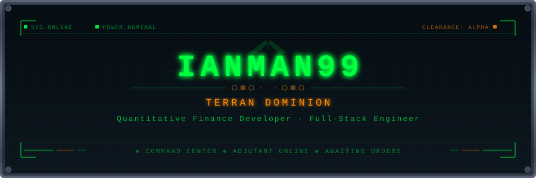

<div align="center">

<!-- ═══════════════════ TERRAN COMMAND CENTER ═══════════════════ -->



<br/>

<a href="https://www.prober.kr"></a>
&nbsp;
<a href="https://ianman99.tistory.com"></a>
&nbsp;
<a href="https://github.com/ianman99"></a>

</div>

<br/>

<div align="center">

</div>

<br/>

<!-- ═══════════════════ BRIEFING ═══════════════════ -->

<div align="center">

</div>

<br/>

```
ADJUTANT> Scanning commander profile...
ADJUTANT> Profile loaded. Displaying dossier.
```

- **Financial Data Platform** & **Automated Trading System**을 구축하는 풀스택 개발자
- [**Prober**](https://www.prober.kr) — 실시간 금융 시세 및 AI 시황 분석 커뮤니티 플랫폼 운영 (React + Node.js)
- DART(전자공시), KRX(한국거래소) 기반 금융 데이터 파이프라인 설계 및 운영
- 이벤트 드리븐 전략(자사주 매입 공시 기반) 자동 매매 시스템 개발
- 주식, 지수, 선물/옵션, 채권, 환율, 원자재, 암호화폐 등 멀티 자산 커버

<br/>

<div align="center">

</div>

<br/>

<!-- ═══════════════════ ENGINEERING BAY ═══════════════════ -->

<div align="center">

</div>

<br/>

<div align="center">

```
┌─── UPGRADE COMPLETE ─────────────────────────────────────────────────┐
│  ▰▰▰▰▰▰▰▰▰▰▰▰▰▰▰▰▰▰▰▰  100%  ALL RESEARCH FINALIZED              │
└──────────────────────────────────────────────────────────────────────┘
```

<table>
<tr><td align="center"><b>⚡ Core</b></td><td>


</td></tr>
<tr><td align="center"><b>🖥 Frontend</b></td><td>


</td></tr>
<tr><td align="center"><b>🏗 Backend</b></td><td>


</td></tr>
<tr><td align="center"><b>🚀 Infra</b></td><td>


</td></tr>
<tr><td align="center"><b>📡 Data</b></td><td>


</td></tr>
<tr><td align="center"><b>📊 Finance</b></td><td>


</td></tr>
</table>

</div>

<br/>

<div align="center">

</div>

<br/>

<!-- ═══════════════════ TACTICAL MAP ═══════════════════ -->

<div align="center">

</div>

<br/>

> **금융 데이터 수집부터 자동 매매까지, 일관된 데이터 파이프라인 아키텍처**

```
 ╔═══════════════════════════════════════════════════════════════════╗
 ║                    TERRAN COMMAND CENTER                         ║
 ║                    ▰▰▰▰▰▰▰▰▰▰ ALL SYSTEMS GREEN                ║
 ╠═════════════════════════════════════════════════════════════════  ║
 ║                                                                  ║
 ║  ◈ COMSAT STATION ─── Recon / Data Collection                    ║
 ║  │                                                               ║
 ║  ├─ dart-fs-total ──────────► 재무제표 일괄 수집 (XBRL Bulk)     ║
 ║  ├─ dart-fs-xbrl ──────────► 재무제표 실시간 모니터링 (DART)     ║
 ║  ├─ price-daily-collector ──► 일별 시세 수집 (멀티 소스)         ║
 ║  └─ price-realtime ─────────► 실시간 시세 스트리밍 (WebSocket)   ║
 ║                                                                  ║
 ║  ◈ GHOST ACADEMY ─── Covert Ops / Strategy                      ║
 ║  │                                                               ║
 ║  └─ quant_buyback ──────────► 자사주 공시 기반 자동 매매         ║
 ║                                                                  ║
 ║  ◈ SUPPLY DEPOT ─── Resource Storage                             ║
 ║  │                                                               ║
 ║  └─ MySQL ──────────────────► price │ fin_db │ dart │ record     ║
 ║                                                                  ║
 ╚══════════════════════════════════════════════════════════════════ ╝
```

<div align="center">

| | Repository | Mission |
|:---:|:---:|:---|
| `SCAN` | [**dart-fs-xbrl**](https://github.com/ianman99/dart-fs-xbrl) | DART 공시 모니터링 → XBRL 파싱(Arelle) → 재무제표 DB 적재 |
| `BUILD` | [**dart-fs-total**](https://github.com/ianman99/dart-fs-total) | DART 재무제표 일괄 다운로드 → 분류/정제 → MySQL 적재 파이프라인 |
| `GATHER` | [**price-daily-collector**](https://github.com/ianman99/price-daily-collector) | KRX·Yahoo·Upbit·TradingView 일별 시세 수집 (9개 테이블) |
| `STREAM` | [**price-realtime-collector**](https://github.com/ianman99/price-realtime-collector) | 네이버·KRX·TradingView·한경 실시간 시세 스트리밍 |
| `STRIKE` | [**quant_buyback**](https://github.com/ianman99/quant_buyback) | 자사주 매입 공시 감지 → 한국투자증권 API 자동 매매 봇 |

</div>

<br/>

<div align="center">

</div>

<br/>

<!-- ═══════════════════ SCIENCE VESSEL ═══════════════════ -->

<div align="center">

</div>

<br/>

```
ADJUTANT> Running full system diagnostic...
ADJUTANT> Scan complete. Results below.
```

<div align="center">


</div>

<br/>

<div align="center">

</div>

<br/>

<!-- ═══════════════════ FOOTER ═══════════════════ -->

<div align="center">

```
╔════════════════════════════════════════════════════════════╗
║                                                            ║
║     "In the rear, with the gear!"  — SCV                   ║
║                                                            ║
║     ◈ ADJUTANT SIGNING OFF                                 ║
║     ◈ TRANSMISSION ENDED                                   ║
║                                                            ║
╚════════════════════════════════════════════════════════════╝
```


<br/>


</div>
